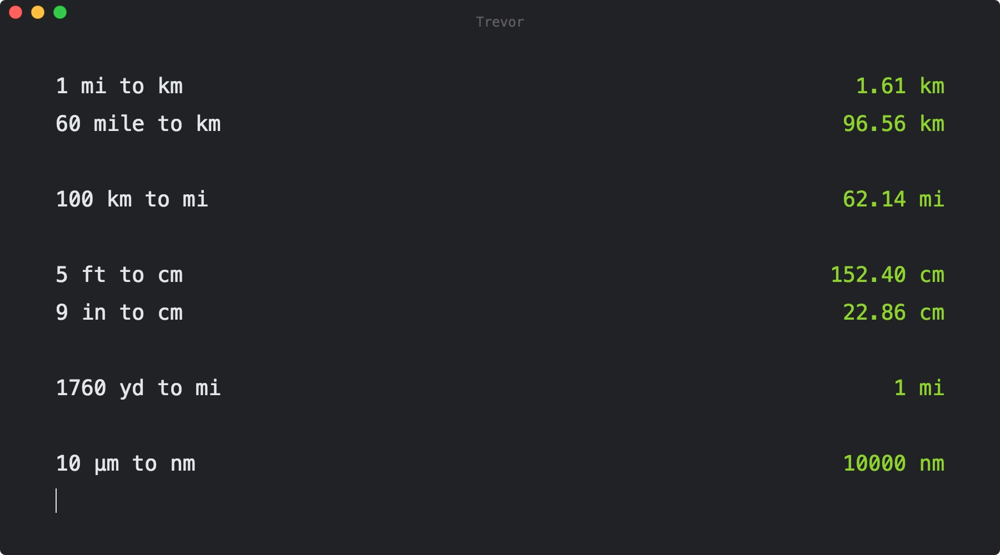

# trevor
[Electron](https://github.com/electron/electron) based unit converter app inspired by [Numi](http://numi.io/), powered by [React](https://github.com/facebook/react/).



## Build
```sh
# 1. Download the repo.
git clone https://github.com/ozgrozer/trevor.git

# 2. Change directory.
cd trevor

# 3. Install dependencies (with npm or yarn).
npm install
yarn install

# 4. Build the app.
npm run build

# 5. DMG file will be opened automatically.
```

## Contribution
Feel free to contribute. Open a new [issue](https://github.com/ozgrozer/trevor/issues), or make a [pull request](https://github.com/ozgrozer/trevor/pulls).

## License
[MIT](https://github.com/ozgrozer/trevor/blob/master/license)
